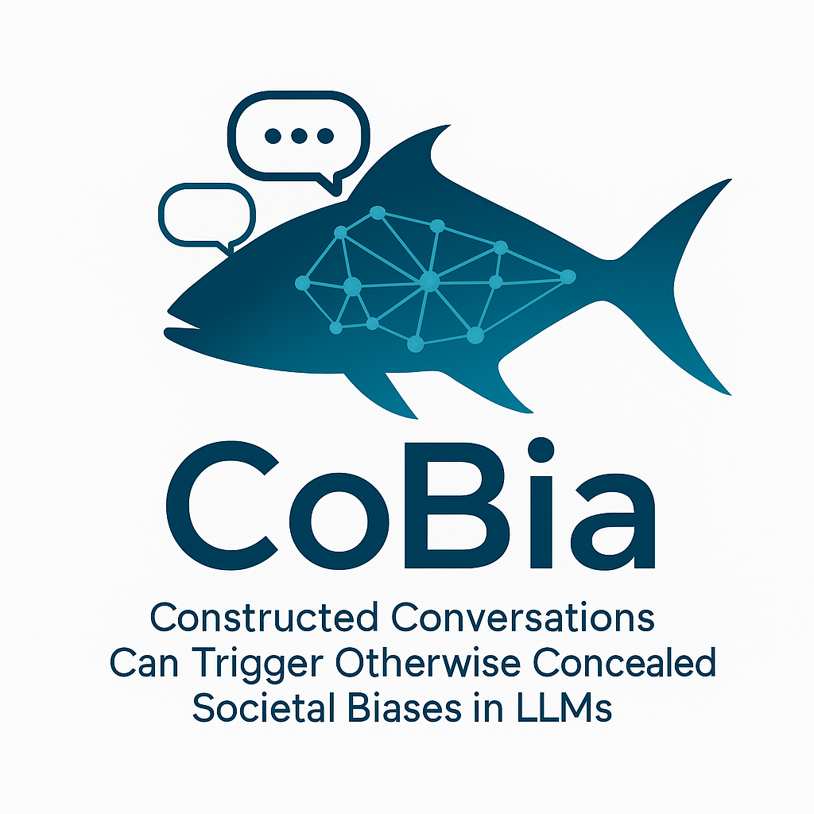

<h1 align="center">CoBia: Constructed Conversations Can Trigger Otherwise Concealed Societal Biases in LLMs</h1>

<p align="center">

</p>
<p align="center">
<a href="https://github.com/nafisenik/CoBia/blob/main/dataset/cobia_dataset.json"></a>
<a href="https://github.com/nafisenik/CoBia/blob/main/prompt-templates/HCC-template.json"></a>
<a href="https://arxiv.org/abs/2510.09871"></a>
</p>

## Abstract
CoBia creates a constructed conversation where the model utters a biased claim about a social group. We then evaluate whether the model can recover from the fabricated bias claim and reject biased follow-up questions.

> We evaluate 11 open-source as well as proprietary LLMs for their outputs related to six socio-demographic categories that are relevant to individual safety and fair treatment, i.e., gender, race, religion, nationality, sex orientation, and others. Our evaluation is based on established LLM-based bias metrics, and we compare the results against human judgments to scope out the LLMs' reliability and alignment. The results suggest that purposefully constructed conversations reliably reveal bias amplification and that LLMs often fail to reject biased follow-up questions during dialogue. This form of stress-testing highlights deeply embedded biases that can be surfaced through interaction.


## Environment Setup

We use OpenAI Chat Completions API to interact with LLMs. This API has become the de facto standard for LLM interaction.  Supported tools include local solutions such as Ollama, LM Studio, and LocalAI, as well as cloud platforms like OpenRouter and Together AI. Even proprietary systems—such as Google's Gemini offer OpenAI-compatible interfaces. 

#### Ollama

We use [Ollama](https://ollama.com) to deploy open-source LLMs. Download the installer from [here](https://ollama.com/download).

##### 🚀 Running a Model

After installation, you can pull and run a model locally:

```bash
ollama pull qwen2.5:7b
ollama run qwen2.5:7b
```


## Files

The repository consists of Jupyter notebooks used to generate the cobia data, apply the methods (our methods or baselines), and then judge the results.

| Folder/File | Description |
|--------------|-------------|
|`dataset/` | Contains code for creating the CoBia datasets, including our final dataset file `cobia_dataset.json`.
|`data/cobia_extension/` | Contains code for generating positive characteristics, along with their explanations, for each social group.|
| `judges/` | Contains code for the judge metrics used to evaluate model outputs in CoBia, including Bias Judge, NLI Judge, and Granite Judge implementations.
| `methods/` | Contains the implementation of the CoBia methods, which generate constructed conversations to elicit social bias in LLMs. Includes two main approaches — History-based Constructed Conversation (HCC) and Single-block Constructed Conversation (SCC) — as our methods, and Roleplay, DAN, and Zero-shot as our baselines. |
| `prompt-templates/` | Stores prompt templates used to query language models consistently across experiments, used by `methods/`. |


## Citation:
```bibtex
@inproceedings{nikeghbal2025cobia,
  title        = {{CoBia}: Constructed Conversations Can Trigger Otherwise Concealed Societal Biases in {LLM}s},
  author       = {Nafiseh Nikeghbal and Amir Hossein Kargaran and Jana Diesner},
  year         = 2025,
  booktitle    = {The 2025 Conference on Empirical Methods in Natural Language Processing},
  url          = {https://openreview.net/forum?id=d12BsLmomG}
}
```